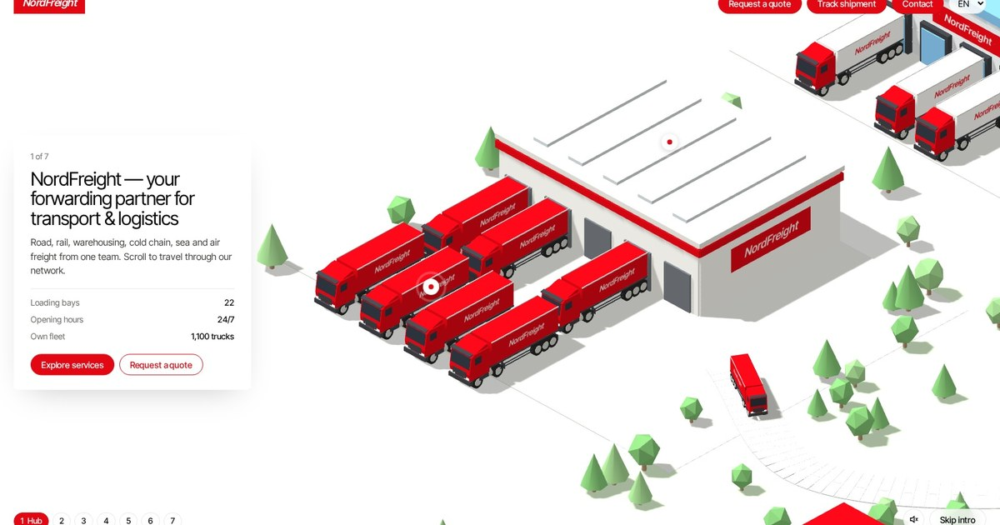

# NordFreight: interactive 3D landing page for a logistics company

**[▶ Live demo](https://sergevei.github.io/nordfreight/)** · [Deutsch](https://sergevei.github.io/nordfreight/?lang=de) · [Русский](https://sergevei.github.io/nordfreight/?lang=ru)

NordFreight is a one-page website for a freight forwarding company. As you scroll, a 3D camera takes you through the company's network: the hub, fleet, rail, warehousing, cold chain, sea and air freight. It's built with Three.js and needs no build step or dependencies.

> **Want a site like this for your business?** I design, build and integrate interactive 3D websites for real companies. [Contact me on Telegram →](https://t.me/vsergeserge)

## Features

- **Scroll-driven 3D tour** in 7 chapters built with Three.js, with navigation by chapter and a "skip intro" option
- **Interactive 3D map** of the branch network
- **Three languages** (EN / DE / RU) that switch without reloading the page and have their own SEO-friendly URLs
- **Responsive design** with a mobile menu, so it works on phones, tablets and desktops
- **SEO-ready:** canonical, hreflang, Open Graph and Twitter Card tags, Schema.org JSON-LD (`Organization`, `WebSite`, `FAQPage`), a sitemap and robots.txt
- **Content in the HTML:** search engines can index the text even without running JavaScript
- **PWA basics:** web manifest, icons for iOS and Android, and a custom 404 page
- **Zero build:** a single `index.html`, with Three.js and fonts loaded from a CDN

## Turn it into a real project

NordFreight is a fictional company, and its text and numbers are only for the demo. I can adapt this concept to your business and connect it to your systems:

- **Your brand and 3D scenes:** your fleet, warehouses, routes, products or facilities modeled in 3D
- **Real content and a CMS:** content your team can edit (headless CMS, Webflow or a custom admin panel)
- **Integrations:** quote request forms connected to your CRM (HubSpot, Bitrix24, Salesforce…), shipment tracking via your TMS/ERP API, email and messenger notifications
- **Analytics and SEO:** Google Analytics / Tag Manager and Yandex Metrica, Search Console, structured data and multilingual SEO
- **Performance and hosting:** 3D models optimized for mobile, your own domain, a CDN and CI/CD

📩 **Telegram: [@vsergeserge](https://t.me/vsergeserge)**: describe your project, and I'll get back to you with ideas, a timeline and an estimate.

## Author

Designed and developed by **Serge Vei**.

- 💼 Portfolio: [sergevei.github.io](https://sergevei.github.io/)
- 💬 Telegram: [@vsergeserge](https://t.me/vsergeserge)

## Project structure

| File | Purpose |
|---|---|
| `index.html` | The whole site (minified HTML, CSS and JS) |
| `favicon.ico`, `favicon.svg`, `apple-touch-icon.png` | Browser and iOS icons |
| `icon-192.png`, `icon-512.png`, `icon-maskable-512.png`, `site.webmanifest` | Android/PWA icons and manifest |
| `og-image.jpg` | Social preview image (1200×630) |
| `robots.txt`, `sitemap.xml` | Search engine indexing |
| `404.html` | "Not found" page for GitHub Pages |
| `.nojekyll` | Turns off Jekyll processing on GitHub Pages |

---

© 2026 [Serge Vei](https://sergevei.github.io/). For a custom version or integration, contact me on [Telegram @vsergeserge](https://t.me/vsergeserge).
